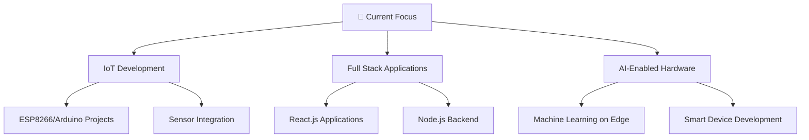

# 👋 Hi there, I'm Bipul Shukla!

<div align="center">
  
[](https://git.io/typing-svg)

</div>

<div align="center">
  
</div>

<div align="center">
  
📍 **India** | 🚀 **Building the Future with IoT & AI**

[](mailto:shukla.b.24785.s@gmail.com)
[](https://linkedin.com/in/bipul-shukla)
[](https://github.com/BipulShukla01)

</div>

<br>

## 🚀 About Me

<div align="center">
  
</div>


```javascript
const bipul = {
    pronouns: "He/Him",
    location: "Kanpur, Uttar Pradesh, India",
    currentFocus: "IoT & AI-Enabled Hardware",
    education: "Computer Science Engineering",
    interests: ["Embedded Systems", "Full Stack Development", "IoT", "AI/ML"],
    funFact: "I love turning ideas into reality through code and circuits! 🔧⚡"
};
```

- 🔭 I'm currently working on **IoT Projects** and **Full Stack Applications**
- 🌱 I'm currently learning **Advanced React Patterns** and **Embedded AI**
- 👯 I'm looking to collaborate on **Open Source IoT Projects**
- 💬 Ask me about **React.js, Node.js, Arduino, ESP8266**
- ⚡ Fun fact: **I can debug hardware and software simultaneously!**

<br>

## 🛠️ Tech Stack & Tools

<div align="center">
  
</div>

### 💻 Programming Languages
<div align="center">


</div>

### 🌐 Frontend Development
<div align="center">


</div>

### ⚙️ Backend Development
<div align="center">


</div>

### 🔧 Hardware & IoT
<div align="center">


</div>

### 🛠️ Tools & Technologies
<div align="center">


</div>

<br>

## 📊 GitHub Statistics

<div align="center">
  
</div>

<div align="center">
  
  
</div>

<div align="center">
  
</div>

<div align="center">
  
</div>

<div align="center">
  
</div>

<br>

## 🚀 Featured Projects

<div align="center">
  
</div>

<div align="center">

### 🎯 Training and Placement Portal
[](https://github.com/BipulShukla01/tp-portal)

**Tech Stack:** React.js • Node.js • Express • JWT • MongoDB • Docker • Vercel

🔹 Full-stack application with Role-Based Access Control (RBAC)  
🔹 File upload functionality using Multer  
🔹 Containerized with Docker and deployed on Vercel  
🔹 Secure authentication with JWT tokens  

---

### 🌬️ Air Quality Monitoring System (IoT)
[](https://github.com/BipulShukla01/air-quality-iot)

**Tech Stack:** Embedded C • ESP8266 • IoT • OLED • BME680

🔹 Real-time air quality monitoring with BME680 sensor  
🔹 OLED display for instant readings  
🔹 Web UI for remote monitoring  
🔹 Indoor Air Quality (IAQ) advisory system  

---

### 📚 Eathenaeum (E-learning Platform)
[](https://github.com/BipulShukla01/eathenaeum)

**Tech Stack:** Node.js • MongoDB • JWT • React.js

🔹 Comprehensive e-learning platform  
🔹 OTP-based secure login system  
🔹 Role-based dashboards for different user types  
🔹 Interactive learning modules  

---

### 💡 Automated Public Light System
[](https://github.com/BipulShukla01/public-light-system)

**Tech Stack:** Arduino • Embedded C • IoT • Smart Cities

🔹 Smart India Hackathon 2023 project  
🔹 Motion sensor-based automation  
🔹 IoT cloud control and monitoring  
🔹 Energy-efficient smart lighting solution  

</div>

<br>

## 🏆 Achievements & Honors

<div align="center">
  
</div>

<div align="center">

| 🏅 Achievement | 📅 Year | 🎯 Details |
|:---|:---:|:---|
| 🚀 **ISRO Research Internship** | 2025 | Selected for Research Internship at ISRO – SAC, Ahmedabad (Jul–Oct 2025) |
| 🥇 **TCS CodeVita Season 12** | 2024 | Global Rank: 1601 among thousands of participants |
| 🧠 **Smart India Hackathon** | 2023 & 2024 | Team Lead for innovative IoT solutions |
| 👨‍🏫 **GDG On Campus Organizer** | 2024 | Google Developer Groups Organizer, Bundelkhand University |
| 🚀 **IDE Bootcamp Finalist** | 2024 & 2025 | Finalist in Vizag (2024) & Udaipur (2025) |

</div>

<div align="center">
  
</div>

<br>

## 📈 Activity Graph

<div align="center">
  
</div>

<div align="center">
  
</div>

<br>

## 🎯 Current Focus

<div align="center">
  
</div>

<div align="center">



</div>

<br>

## 📫 Let's Connect!

<div align="center">
  
</div>

<div align="center">

### 🌟 Ready to collaborate on exciting projects!

<a href="mailto:shukla.b.24785.s@gmail.com">
  
</a>
<a href="https://linkedin.com/in/bipul-shukla">
  
</a>
<a href="https://github.com/BipulShukla01">
  
</a>

</div>

<div align="center">
  
</div>

<div align="center">
  
**💡 "Innovation distinguishes between a leader and a follower." - Steve Jobs**

</div>

---

<div align="center">
  
  
</div>

<div align="center">
  
### ⭐ Don't forget to star my repositories if you find them interesting!

</div>